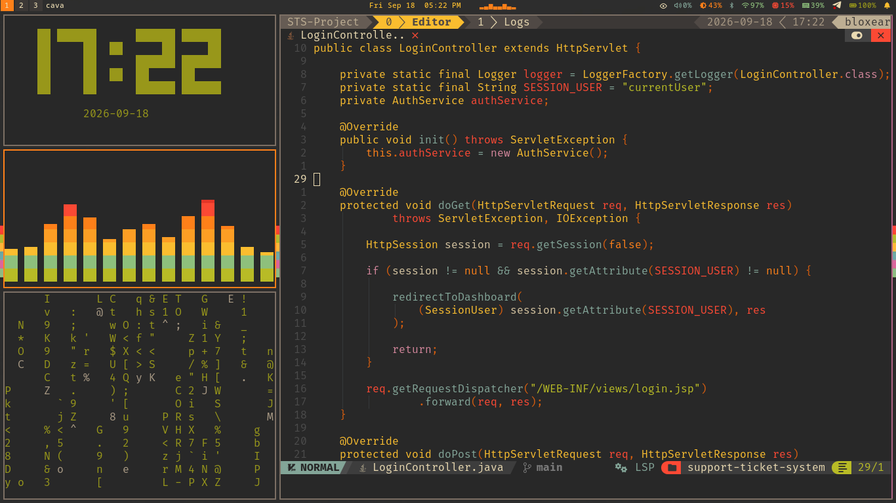
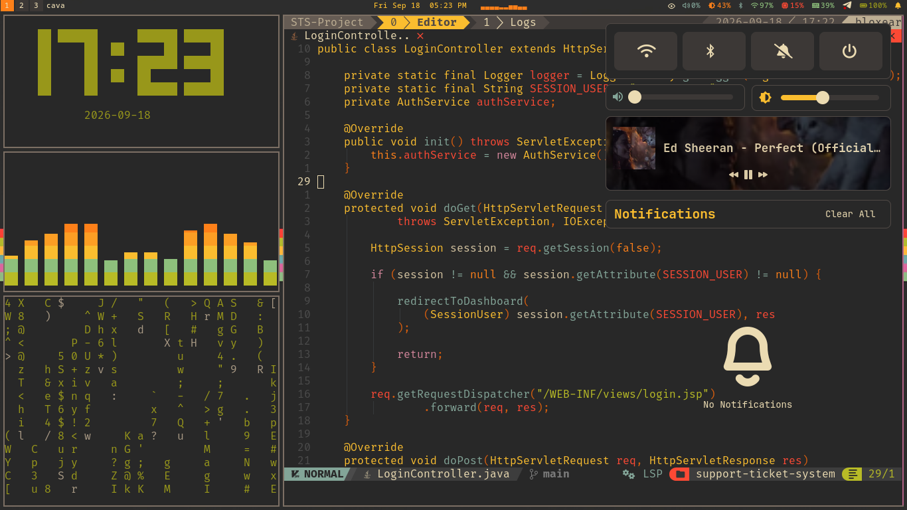
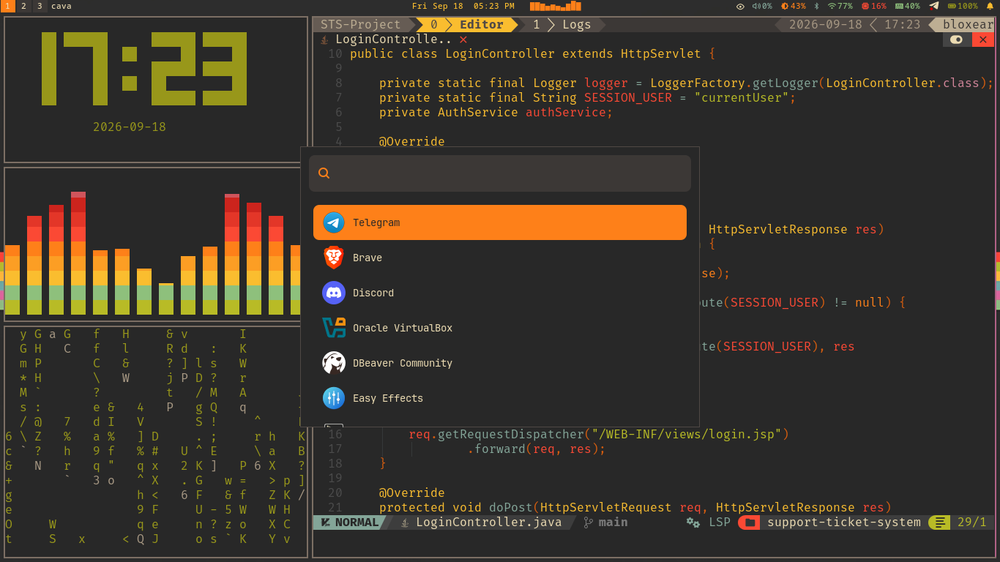
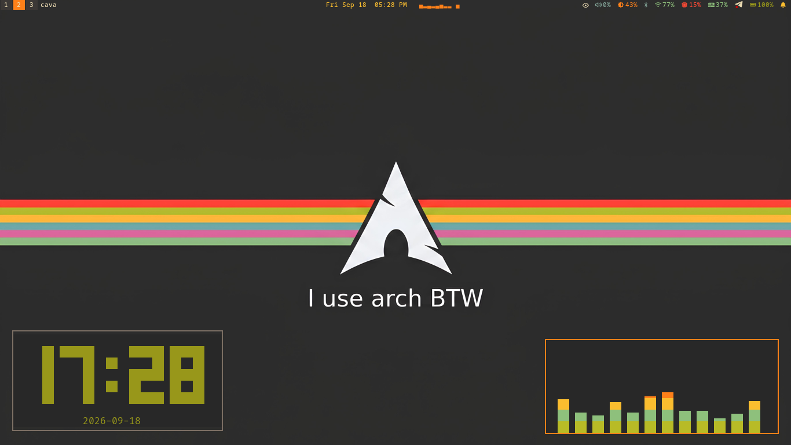
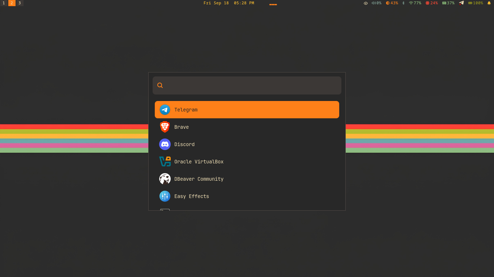
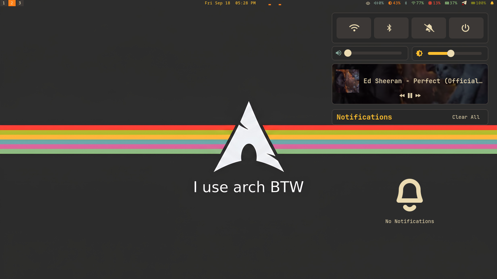
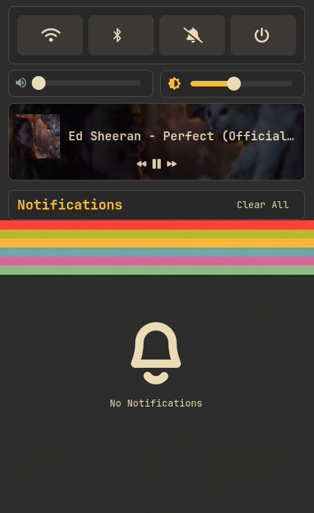
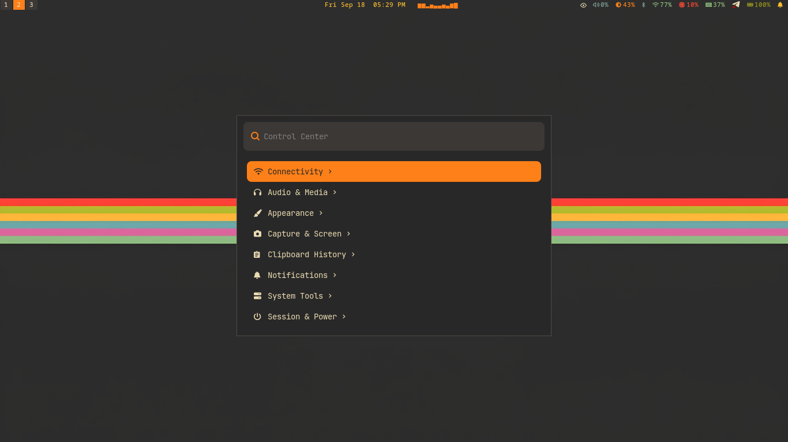

# 0xProf3ssor's Dotfiles

A highly customized, terminal-focused development environment featuring a cohesive "Floating Glass" **Gruvbox Material Dark** theme across all applications. This configuration provides a beautiful, productive Wayland workspace.

## 📸 Screenshots

<details>
<summary>Click to view screenshots!</summary>
<br>










</details>

## 🛠️ The Stack

- **Window Manager**: [Sway](https://github.com/swaywm/sway) (Wayland)
- **Status Bar**: [Waybar](https://github.com/Alexays/Waybar)
- **App Launcher**: [Wofi](https://hg.sr.ht/~scoopta/wofi) (Themed to match floating cards)
- **Control Center & Notifications**: [SwayNC](https://github.com/ErikReider/SwayNotificationCenter) (Custom 8px rounded floating cards with 1px Gruvbox borders)
- **Power Menu**: [Wlogout](https://github.com/ArtsyMacaw/wlogout) 
- **Media Popups**: [SwayOSD](https://github.com/ErikReider/SwayOSD)
- **Terminals**: [Foot](https://codeberg.org/dnkl/foot) / [Alacritty](https://github.com/alacritty/alacritty)
- **Shell**: [Zsh](https://www.zsh.org/) + [Starship](https://starship.rs/) Prompt
- **Editor**: [Neovim](https://neovim.io/) (NvChad v2.5 + LSP + Conform)
- **Multiplexer**: [Tmux](https://github.com/tmux/tmux)
- **File Manager**: [Yazi](https://github.com/sxyazi/yazi)
- **System Monitor**: [Btop](https://github.com/aristocratos/btop) / [Htop](https://htop.dev/)
- **Audio Visualizer**: [Cava](https://github.com/karlstav/cava)
- **GTK Theme**: Gruvbox Material Dark

## 🏗️ Architecture

This repository uses a **Flat Stow Architecture**. Every application has its own root folder containing a `.config/` directory. This makes it incredibly easy to selectively install exactly which components you want.

## 🚀 Installation

These dotfiles are managed using [GNU Stow](https://www.gnu.org/software/stow/). 

**1. Clone the repository:**
```bash
git clone https://github.com/0xProf3ssor/dotfiles.git ~/dotfiles
cd ~/dotfiles
```

**2. Symlink everything using Stow:**
To install all configurations at once, simply run:
```bash
stow */
```

To install specific configurations, specify the folder name:
```bash
stow swaync waybar wofi
```

*Note: Stow creates symlinks from this repository to your `~/.config/` directory. If you already have a physical file in `~/.config/` for a specific app, Stow will warn you. You must delete the existing folder/file before Stowing.*

### 📜 Custom Scripts
This repository includes a `scripts/` package which automatically populates your `~/.local/bin/` folder with all the custom shell scripts required for this rice to function properly (e.g. `wlogout-toggle`, `wofi-bluetooth`, `waybar-cava.py`). Make sure `~/.local/bin` is in your `$PATH`!
